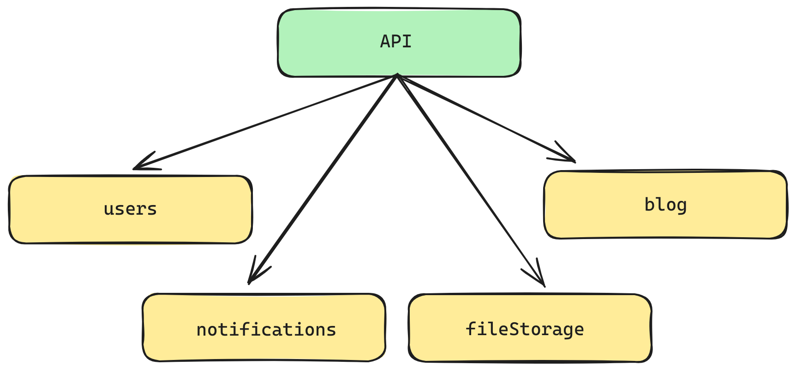

# Проект «Readme»

---


## Инструкции по запуску

### 1. Создать env файлы

Создать env файлы в директориях приложений:

- project/apps/api-gateway/.api-gateway.env
- project/apps/blog/.blog.env
- project/apps/file-storage/.file-storage.env
- project/apps/notifications/.notifications.env
- project/apps/users/.users.env

Там же находятся примеры env файлов со всеми переменными, которые требуется указать.

---

### 2. Развернуть docker контейнеры

```shell
docker compose --file ./apps/blog/docker-compose.dev.yml --env-file ./apps/blog/.blog.env --project-name "readme-blog" up -d --remove-orphans

docker compose --file ./apps/file-storage/docker-compose.dev.yml --env-file ./apps/file-storage/.file-storage.env --project-name "readme-file-storage" up -d --remove-orphans

docker compose --file ./apps/notifications/docker-compose.dev.yml --env-file ./apps/notifications/.notifications.env --project-name "readme-notifications" up -d --remove-orphans

docker compose --file ./apps/users/docker-compose.dev.yml --env-file ./apps/users/.users.env --project-name "readme-users" up -d --remove-orphans
```



---

### 3. Подключить сервер Postgres для Blog service

PGAdmin -> Object -> Register -> Server...

Вкладка General -> поле Name: readme_blog

Вкладка Connection -> поле username: POSTGRES_USER из env файла

Вкладка Connection -> поле password: POSTGRES_PASSWORD из env файла

---

### 4. Установить npm пакеты

```
cd project
npm i
```

---

### 5. Сгенерировать клиент Prisma для Blog service

```shell
npx nx run blog:db:generate
```

---

### 6. Сбросит БД postgres и произвести начальные миграции

```shell
npx nx run blog:db:reset
```

### 6.1 При необходимости наполнить БД Blog service моковыми данными

```shell
npx nx run blog:db:seed
```

---

### 7. Запустить сервисы

```shell
npx nx run api-gateway:serve
npx nx run blog:serve
npx nx run file-storage:serve
npx nx run notifications:serve
npx nx run users:serve
```

---

### 8. Ручное тестирование рест запросов доступно с помощью приложенных *.http файлов

- project/apps/api-gateway/src/app/app.http
- project/apps/blog/src/app/post/post.http
- project/apps/blog/src/app/comment/comment.http
- project/apps/file-storage/src/app/uploader/uploader.http
- project/apps/users/src/app/authentication/authentication.http

---

